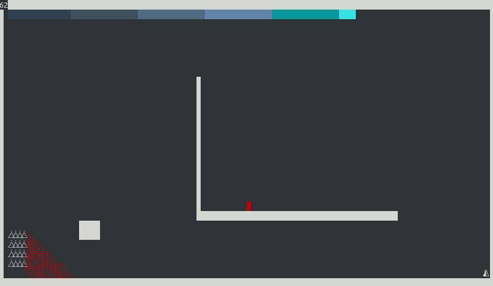

# Realtime rust platformer game

To run: `cargo run --release`

Just one test map implemented for the time being

## Controls

|Button|  Effect|
|---|---|
|Arrows or WASD| move (down arrow to stop moving)|
|Space| jump|
|k| kill player|
|r| respawn|
|c| clear particles|
|f| boost dash|
|q| quit|
|right click| respawn player at cursor|
|left click| place blocks|
